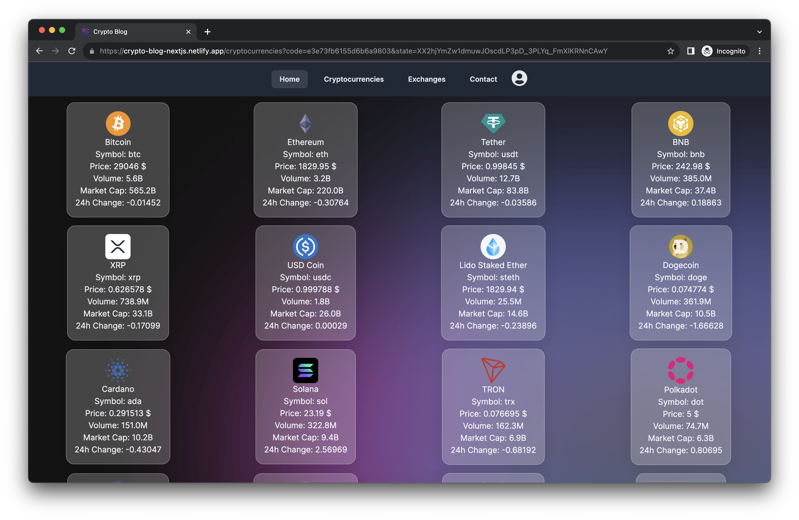
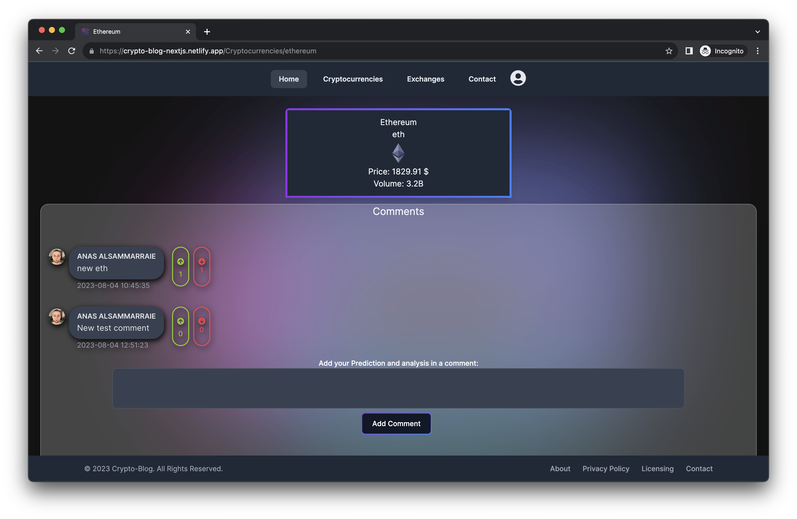
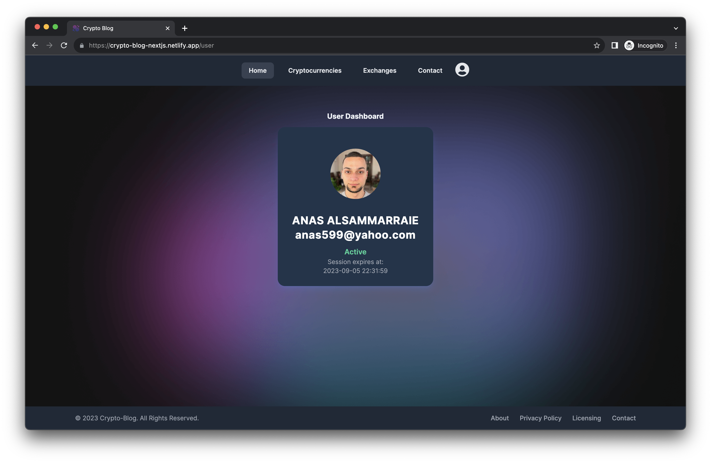

  

 

  
  
  
  

 

# 📗 Table of Contents

- [📖 About the Project](#about-project)
  - [🛠 Built With](#built-with)
    - [Tech Stack](#tech-stack)
    - [Key Features](#key-features)
- [💻 Getting Started](#getting-started)
  - [Setup](#setup)
  - [Prerequisites](#prerequisites)
  - [Install](#install)
  - [Usage](#usage)
- [👥 Authors](#authors)
- [🔭 Future Features](#future-features)
- [🤝 Contributing](#contributing)
- [⭐️ Show your support](#support)
- [🙏 Acknowledgements](#acknowledgements)
- [📝 License](#license)

# 📖 Crypto Blog 

Crypto Blog: A Next.js web app with Prisma adapter for real-time cryptocurrency data. Engage in community-driven discussions, add predictions, and vote on comments. NextAuth ensures secure authentication. Stay informed and join the crypto community! 🚀💰
**Crypto Blog**

## 🛠 Built With 

Nextjs 13
Prisma PSQL

### Tech Stack 

> Nextjs 13

Nextjs

  <ul>
    <li><a href="https://nextjs.org/">Nextjs</a></li>
  </ul>

### Key Features 

- Real-time cryptocurrency data
- Vote on comments.
- NextAuth ensures secure authentication.

(<a href="#readme-top">back to top</a>)

## 💻 Getting Started 

- Crypto-blog

### Prerequisites

In order to run this project you need:

npm install
npm run dev

### Setup

Clone this repository to your desired folder:
cd Crypto-blog

    git clone https://github.com/anas599/Crypto-blog.git

### Install

Install this project with:

cd Crypto-blog
npm i

### Usage

npm run dev

(<a href="#readme-top">back to top</a>)
👥 Authors 

👤 **ANAS ALSAMMARRAIE**

- GitHub: [@anas599](https://github.com/anas599)
- Twitter: [@anas599](https://twitter.com/anas599)
- LinkedIn: [anas1993](https://linkedin.com/in/anas1993)

(<a href="#readme-top">back to top</a>)

## 🔭 Future Features 

- Add animation and transition
- Add Buy using debit card

(<a href="#readme-top">back to top</a>)

## 🤝 Contributing 

Contributions, issues, and feature requests are welcome!

Feel free to check the [issues page](../../issues/).

(<a href="#readme-top">back to top</a>)

## ⭐️ Show your support 

> If you like the project Please do not hesitate if you have any questions

(<a href="#readme-top">back to top</a>)

## 🙏 Acknowledgments 

> I extend my gratitude to CoinGecko and Coinmarketcap for their API support. 
> It has greatly improved our project's functionality.

(<a href="#readme-top">back to top</a>)

## 📝 License 

This project is [MIT](./LICENSE) licensed.

(<a href="#readme-top">back to top</a>)

